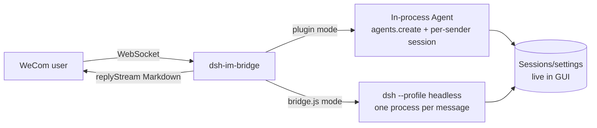

[中文](./README.md) | English

<div align="center">

# dsh-im-bridge

**WeCom AI Bot ⇄ DeepSeek Harness Agent bridge**

Connect WeCom (WeChat Work) AI Bot over a long-lived WebSocket, hand messages to a [DeepSeek Harness](https://github.com/deepseek-ai/deepseek-harness) Agent, and stream replies back to WeCom.


</div>

---

## Project overview

This repository ships two run modes:

| Mode | Description | Status |
|---|---|---|
| **`plugin/`** | DSH plugin (recommended): mounts into a dsh profile, creates Agents **in-process**, per-sender durable sessions visible in the Web GUI, with a Settings config card | Recommended |
| **`bridge.js`** | Legacy standalone script: spawns `dsh --profile headless` per message (stateless) | Kept as fallback |

## Features

- **Direct WebSocket**: no public URL, no message crypto, no IP allowlist
- **In-process Agent**: no child process spawn; sessions register with the GUI for live view and continue-chat
- **Per-sender durable sessions**: the same WeCom user reuses one session with memory
- **Custom persona**: zh/en packaged defaults follow Settings language; override with `persona.md` next to the profile patch
- **Hot config**: `allowFrom` / `agentTimeoutSec` / `startHint` editable in Settings → Plugins or `settings.yaml` without restart
- **Streaming animation + completion footer**: stage/progress/ETA while running; duration summary when done
- Auth / heartbeat / exponential reconnect (built into the SDK)
- Serial handling per sender to avoid concurrent mix-ups

## Architecture



## Contents

- [Quick start](#quick-start)
- [Configuration](#configuration)
- [Persona (`persona.md`)](#persona-personamd)
- [Legacy `bridge.js`](#legacy-bridgejs)
- [Known limits](#known-limits)
- [Security](#security)
- [License](#license)

## Quick start

### Prerequisites

- Node.js 18+ (required for legacy `bridge.js`; the plugin runs with dsh)
- [DeepSeek Harness](https://github.com/deepseek-ai/deepseek-harness) installed

### 1. WeCom: create an AI Bot (once)

1. Open the [WeCom Admin Console](https://work.weixin.qq.com/wework_admin/frame)
2. **Apps → AI Bot → Create**, set name/avatar
3. Save credentials (**Secret is shown once**): `BotID` and `Secret`

### 2. Install the plugin (recommended: npm package)

```powershell
# 1) Install into the target profile (e.g. web)
dsh plugin --profile web add @mhfire/dsh-im-bridge
# Or pin a version: dsh plugin --profile web add @mhfire/dsh-im-bridge@0.1.2

# 2) In $DSH_HOME/profiles/web/cordis.patch.yml, supply credentials
#    (other fields ship as bundle defaults; override as needed)
# - id: im-bridge
#   config:
#     botId: "<your BotID>"
#     secret: "<your Secret>"
#     # optional: workspace / personaFile / …

# 3) Restart dsh (e.g. dsh web / pnpm dsh web)
# 4) Message the bot in WeCom
```

### From source / local development (optional)

```powershell
dsh plugin --profile web add <repo-path>/plugin
```

### 3. Verify

The bot replies in WeCom, and the session appears in the DSH Web GUI session list (live view and continue-chat).

## Configuration

Copy `config.example.json` to `config.json` and fill in values (**`config.json` holds secrets; do not commit**):

| Field | Description |
|---|---|
| `botId` / `secret` | WeCom AI Bot credentials |
| `workspace` | Agent working directory (session cwd) |
| `dshCli` | Path to the `dsh` CLI entry (legacy `bridge.js` only) |
| `agentTimeoutSec` | Max seconds per task |
| `allowFrom` | Allowed sender userids; empty `[]` = allow everyone |
| `startHint` | Placeholder text when processing starts |
| `thinking` | Streaming animation: tools / model reasoning vs output / timed fallback (see `plugin/README.en.md`) |
| `deniedMessage` / `welcomeMessage` | Deny text / enter-chat welcome |

> **`patch`** (legacy `bridge.js` only, optional): path to a workspace `--patch` overlay
> (default `workspace/headless.patch.yml`, local config not in this repo). Add it yourself if needed, e.g. `"patch": "headless.patch.yml"`.

For the plugin, `allowFrom` / `agentTimeoutSec` / `startHint` can be edited under **Settings → Plugins**, written to `settings.yaml` with hot reload, or set in the profile patch.

## Persona (`persona.md`)

Precedence: `personaFile` → `persona` string → packaged default (zh/en via Host `locale.preference`; Chinese when unset).

- **Recommended**: place `persona.md` next to `cordis.patch.yml` under `$DSH_HOME/profiles/<name>/`, and set `personaFile` to that absolute path (overrides do not follow language)
- Defaults: `plugin/persona.default.md` / `plugin/persona.default.en.md`; template: `plugin/persona.example.md`
- **Do not commit secret-bearing persona files**
- Placeholders: `{{model}}` / `{{cwd}}` (unknown placeholders fail loudly)

## Legacy `bridge.js`

```powershell
cd <repo-path>
npm install
node bridge.js
```

When you see `[bridge] 认证成功, 等待消息...`, it is ready. Each message spawns a separate
`dsh --profile headless` process (stateless). `config.json` is read once at startup; changes require a restart.

## Known limits

- v1 handles text only (image/voice/file ignored; SDK supports them but not wired)
- Legacy `bridge.js` may hit `spawn EPERM` in restricted sandboxes; run normally
- Legacy mode starts one agent process per message (expensive); the plugin does not
- Agent output above ~20KB is truncated (WeCom `replyStream` limit is 20480 bytes)

## Security

- `config.json` and `plugin/persona.md` are gitignored — **do not force-add or publish them**
- Before publishing, check `docs/` and examples for environment-specific secrets

## License

[MIT](./LICENSE)

## References

- [WeCom channel notes](./docs/wecom.md) (Chinese)
- [WeCom AI Bot official SDK](https://github.com/WecomTeam/aibot-node-sdk) (doc mirror: `docs/aibot-node-sdk-README.md`)
- [DeepSeek Harness](https://github.com/deepseek-ai/deepseek-harness)
