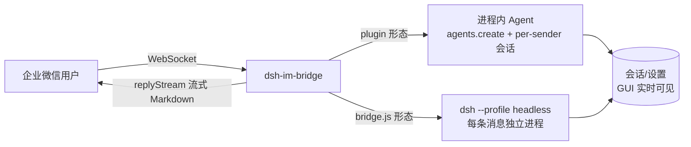

<div align="center">

# dsh-im-bridge

**企业微信智能机器人 ⇄ DeepSeek Harness Agent 桥接**

通过企业微信智能机器人的 WebSocket 长连接，把企业微信消息交给 [DeepSeek Harness](https://github.com/deepseek-ai/deepseek-harness) 的 Agent 处理，再将结果流式回复到微信。


</div>

---

## 📦 项目简介

本仓库提供两种运行形态：

| 形态 | 说明 | 状态 |
|---|---|---|
| **`plugin/`** | DSH 插件（推荐）：挂进 dsh profile，**进程内**创建 Agent，per-sender 持久会话，会话在 Web GUI 实时可见，含 Settings 配置卡片 | ✅ 推荐 |
| **`bridge.js`** | 旧版独立脚本：每条消息 spawn `dsh --profile headless` 子进程（无状态） | 保留作回退 |

## ✨ 特性

- ✅ **WebSocket 直连**：无需公网 URL、无需消息加解密、无需 IP 白名单
- ✅ **进程内 Agent**：不 spawn 子进程，会话与 GUI 同进程注册，**实时可见、可续聊**
- ✅ **per-sender 持久会话**：同一企业微信用户复用同一会话，有上下文记忆
- ✅ **人设可定制**：`persona.md` 即机器人「人设」，作为系统提示词注入每个会话
- ✅ **配置热生效**：`allowFrom` / `agentTimeoutSec` / `startHint` 可在 Settings 插件配置页或 `settings.yaml` 修改，无需重启
- ✅ **流式动画 + 执行简报**：处理中显示阶段状态/进度条/剩余估算，完成附耗时简报
- ✅ 自动认证 / 心跳保活 / 断线指数退避重连（SDK 内置）
- ✅ 同一发送者消息串行处理，防并发错乱

## 🏗️ 架构



## 📑 目录

- [快速开始](#-快速开始)
- [配置说明](#-配置说明)
- [人设提示词](#-人设提示词personamd)
- [旧版 bridge.js](#-旧版-bridgejslegacy)
- [已知边界](#-已知边界)
- [安全说明](#-安全说明)
- [许可证](#-许可证)

## 🚀 快速开始

### 前提

- Node.js 18+（旧版 `bridge.js` 需要；插件随 dsh 运行）
- 已安装 [DeepSeek Harness](https://github.com/deepseek-ai/deepseek-harness)

### 1. 企业微信侧：创建智能机器人（一次性）

1. 登录[企业微信管理后台](https://work.weixin.qq.com/wework_admin/frame)
2. **应用管理 → 智能机器人 → 创建智能机器人**，填写名称/头像
3. 记录凭证（**Secret 只显示一次，立即保存**）：`BotID` 与 `Secret`

### 2. 安装插件（推荐方式）

```powershell
# 1) 把插件装进目标 profile（如 web）
dsh plugin --profile web add <本仓库路径>/plugin

# 2) 在 profile 的 cordis.patch.yml 中配置插件行
# - id: im-bridge
#   config:
#     botId: "<你的 BotID>"
#     secret: "<你的 Secret>"
#     workspace: "<你的工作区>"
#     personaFile: "<绝对路径>/persona.md"

# 3) 重启 dsh 进程
# 4) 在企业微信给机器人发消息即可使用
```

### 3. 验证

企业微信收到机器人回复；同时该会话出现在 DSH Web GUI 的会话列表中（可实时查看、续聊）。

## ⚙️ 配置说明

复制 `config.example.json` 为 `config.json` 并填写（**`config.json` 含密钥，不入库**）：

| 字段 | 说明 |
|---|---|
| `botId` / `secret` | 企业微信智能机器人凭证 |
| `workspace` | Agent 的工作目录（会话 cwd） |
| `dshCli` | `dsh` CLI 的入口脚本路径（仅旧版 `bridge.js` 需要） |
| `agentTimeoutSec` | 单任务最长执行时间（秒） |
| `allowFrom` | 允许的发送者 userid 列表；留空 `[]` = 允许所有人 |
| `startHint` | 开始处理时的占位提示语 |

> **`patch` 字段**（旧版 `bridge.js` 专用，可选）：指向工作区的 `--patch` 覆盖层文件
> （默认 `workspace/headless.patch.yml`，本地配置文件，不在本仓库内）。示例配置已移除该字段，
> 需要时自行添加，例如 `"patch": "headless.patch.yml"`。

插件运行时，`allowFrom` / `agentTimeoutSec` / `startHint` 可在 **Settings → 插件配置** 页面编辑，
写入 `settings.yaml` 热生效，也可直接修改 profile patch。

## 🤖 人设提示词（persona.md）

`persona.md` 是机器人的**人设**（角色设定与行为规范），作为系统提示词注入每个会话，决定机器人以什么身份、按什么规则回答。

- 插件通过 `personaFile` 指向该文件；想换人设就改这里
- 模板见 `plugin/persona.example.md`（示例为"办公助手"人设，可改为客服、技术专家等）
- **`persona.md` 可能包含你的环境凭据等敏感信息，不入库**：复制 `plugin/persona.example.md` 为 `plugin/persona.md` 后按需填写
- 提示词支持 `{{model}}` / `{{cwd}}` 两个占位符（未知变量会直接报错）

## 🛠️ 旧版 bridge.js（legacy）

```powershell
cd <本仓库路径>
npm install
node bridge.js
```

看到 `[bridge] 认证成功, 等待消息...` 即可使用。每条消息会 spawn 一个独立的
`dsh --profile headless` 进程（无状态）；`config.json` 在启动时读取一次，改动需重启。

## ⚠️ 已知边界

- v1 仅处理文本消息（图片/语音/文件消息会忽略，SDK 支持但未接入）
- 旧版 `bridge.js` 在受限沙箱内测试可能报 `spawn EPERM`，请以普通方式启动
- 旧版每条消息起一个 agent 进程，开销较高；插件形态无此问题
- agent 输出超过约 20KB 会截断（企微 replyStream 上限 20480 字节）

## 🔒 安全说明

- `config.json`、`plugin/persona.md` 已被 `.gitignore` 排除，**请勿强制添加或发布**
- 发布到公开仓库前，请检查 `docs/`、示例文件等是否含有环境专属信息

## 📄 许可证

[MIT](./LICENSE)

## 🔗 参考

- 📚 [企业微信渠道接入说明](./docs/wecom.md)
- [企业微信智能机器人官方 SDK](https://github.com/WecomTeam/aibot-node-sdk)（文档副本：`docs/aibot-node-sdk-README.md`）
- [DeepSeek Harness](https://github.com/deepseek-ai/deepseek-harness)
