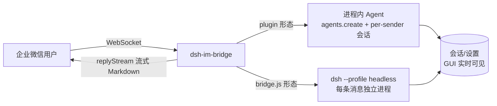

中文 | [English](./README.en.md)

<div align="center">

# dsh-im-bridge

**企业微信智能机器人 ⇄ DeepSeek Harness Agent 桥接**

通过企业微信智能机器人的 WebSocket 长连接，把企业微信消息交给 [DeepSeek Harness](https://github.com/deepseek-ai/deepseek-harness) 的 Agent 处理，再将结果流式回复到微信。


</div>

---

## 📦 项目简介

本仓库提供两种运行形态：

| 形态 | 说明 | 状态 |
|---|---|---|
| **`plugin/`** | DSH 插件（推荐）：挂进 dsh profile，**进程内**创建 Agent，per-sender 持久会话，会话在 Web GUI 实时可见，含 Settings 配置卡片 | ✅ 推荐 |
| **`bridge.js`** | 旧版独立脚本：每条消息 spawn `dsh --profile headless` 子进程（无状态） | 保留作回退 |

## ✨ 特性

- ✅ **WebSocket 直连**：无需公网 URL、无需消息加解密、无需 IP 白名单
- ✅ **进程内 Agent**：不 spawn 子进程，会话与 GUI 同进程注册，**实时可见、可续聊**
- ✅ **per-sender 持久会话**：同一企业微信用户复用同一会话，有上下文记忆
- ✅ **人设可定制**：包内中/英默认人设跟 Settings 语言；可用 profile 同目录 `persona.md` 覆盖
- ✅ **Settings 配置卡**：凭证、白名单、超时、提示语、模型覆盖可在 GUI 填写；热字段下一轮消息生效，改凭证须重启才连 WebSocket
- ✅ **流式动画 + 执行简报**：处理中显示阶段状态/进度条/剩余估算，完成附耗时简报
- ✅ **回复里的工作区 PNG**：最终回复中的 `` 会在文字之后作为独立图片消息发出
- ✅ 自动认证 / 心跳保活 / 断线指数退避重连（SDK 内置）
- ✅ 同一发送者消息串行处理，防并发错乱

## 🏗️ 架构



## 📑 目录

- [兼容的 DeepSeek Harness 版本](#-兼容的-deepseek-harness-版本)
- [快速开始](#-快速开始)
- [Settings 插件配置卡](#-settings-插件配置卡)
- [配置说明](#-配置说明)
- [人设提示词](#-人设提示词personamd)
- [旧版 bridge.js](#-旧版-bridgejslegacy)
- [已知边界](#-已知边界)
- [安全说明](#-安全说明)
- [许可证](#-许可证)

## 📌 兼容的 DeepSeek Harness 版本

DeepSeek Harness 仍是 developer preview，对外置插件**没有 semver 兼容承诺**。插件 0.2.0 按实际调用的 API 对齐已发布 tag（细则见 [`plugin/README.md`](./plugin/README.md)）：

| DSH | 本仓库插件 |
|---|---|
| [0.1.0-rc.8](https://github.com/deepseek-ai/deepseek-harness/releases/tag/dsh-v0.1.0-rc.8)、[0.1.1-rc.1](https://github.com/deepseek-ai/deepseek-harness/releases/tag/dsh-v0.1.1-rc.1)、[0.1.1-rc.2](https://github.com/deepseek-ai/deepseek-harness/releases/tag/dsh-v0.1.1-rc.2) | 可适配（对照开发的是 0.1.1-rc.2 一线） |
| [0.1.0-rc.7](https://github.com/deepseek-ai/deepseek-harness/releases/tag/dsh-v0.1.0-rc.7) 及更早 | 不可适配。rc.7 已有插件配置卡槽位和 `dsh plugin add`，但浏览器没有 `settingsScope.describe()`，配置卡加载和凭证「已配置」徽章会失败 |
| 更新的 RC / 未打 tag 的 HEAD | 未保证。升级 dsh 后请再验 Settings 卡和企微连线 |

建议把 `dsh` 钉在 `0.1.0-rc.8` 及以上，例如 `npx @deepseek-ai/dsh@0.1.1-rc.2 web`，不要只跑浮动的 `latest`。旧版 `bridge.js` 只要求本机有 `dsh` CLI，不受上表约束。

## 🚀 快速开始

### 前提

- Node.js 18+（旧版 `bridge.js` 需要；插件随 dsh 运行）
- 已安装 [DeepSeek Harness](https://github.com/deepseek-ai/deepseek-harness) **0.1.0-rc.8 及以上**（见上一节）

### 1. 企业微信侧：创建智能机器人（一次性）

1. 登录[企业微信管理后台](https://work.weixin.qq.com/wework_admin/frame)
2. **应用管理 → 智能机器人 → 创建智能机器人**，填写名称/头像
3. 记录凭证（**Secret 只显示一次，立即保存**）：`BotID` 与 `Secret`

### 2. 安装插件（推荐：npm 包）

```powershell
# 1) 从 npm 装进目标 profile（如 web）
dsh plugin --profile web add @mhfire/dsh-im-bridge
# 或钉版本：dsh plugin --profile web add @mhfire/dsh-im-bridge@0.2.0

# 2) 在 $DSH_HOME/profiles/web/cordis.patch.yml 中补密钥（其余为 bundle 默认，可按需覆盖）
# - id: im-bridge
#   config:
#     botId: "<你的 BotID>"
#     secret: "<你的 Secret>"
#     # 可选：workspace / personaFile 等

# 3) 重启 dsh 进程（建议钉版本，如 npx @deepseek-ai/dsh@0.1.1-rc.2 web）
# 4) 也可在 Settings → 插件 → 插件配置 → 企业微信桥接 填写 botId/secret 后重启
# 5) 在企业微信给机器人发消息即可使用
```

### 从源码 / 本地开发（备选）

```powershell
dsh plugin --profile web add <本仓库路径>/plugin
```

### 3. 验证

企业微信收到机器人回复；同时该会话出现在 DSH Web GUI 的会话列表中（可实时查看、续聊）。

## 🧩 Settings 插件配置卡

安装插件并启动 `dsh web` 后，打开 **设置 → 插件 → 插件配置**，展开 **企业微信桥接**。**保存** 写入 `settings.yaml` 用户层，与 profile `cordis.patch.yml` 同一层。

| 卡片项 | 对应配置 | 保存后 |
|---|---|---|
| Bot ID / Secret | `botId` / `secret` | 徽章变为「已配置」；**须重启进程** 才会连 WebSocket。留空再保存不会清空已存凭证 |
| 允许的发送者 userid | `allowFrom` | 下一轮消息生效 |
| 单任务超时（秒） | `agentTimeoutSec` | 下一轮消息生效 |
| 开始处理时的占位提示 | `startHint` | 下一轮消息生效 |
| 非白名单拒绝文案 / 欢迎语 | `deniedMessage` / `welcomeMessage` | 下一轮消息生效 |
| 企微专用 provider / model | `provider` / `model` | 只影响之后新建的发送者会话；须两项都填才覆盖 |

`workspace`、人设、`thinking` 等不在卡片上，见下表或 [`plugin/README.md`](./plugin/README.md)。

## ⚙️ 配置说明

复制 `config.example.json` 为 `config.json` 并填写（**`config.json` 含密钥，不入库**）：

| 字段 | 说明 |
|---|---|
| `botId` / `secret` | 企业微信智能机器人凭证 |
| `workspace` | Agent 的工作目录（会话 cwd） |
| `dshCli` | `dsh` CLI 的入口脚本路径（仅旧版 `bridge.js` 需要） |
| `agentTimeoutSec` | 单任务最长执行时间（秒） |
| `provider` / `model` | 企微专用模型；两者都填才覆盖 GUI 的 `agent-default-model` |
| `allowFrom` | 允许的发送者 userid 列表；留空 `[]` = 允许所有人 |
| `startHint` | 开始处理时的占位提示语 |
| `thinking` | 流式动画：工具 / 模型推理与输出阶段 / 时间轴兜底（见 `plugin/README.md`） |
| `deniedMessage` / `welcomeMessage` | 拒绝文案 / 进入会话欢迎语 |

> **`patch` 字段**（旧版 `bridge.js` 专用，可选）：指向工作区的 `--patch` 覆盖层文件
> （默认 `workspace/headless.patch.yml`，本地配置文件，不在本仓库内）。示例配置已移除该字段，
> 需要时自行添加，例如 `"patch": "headless.patch.yml"`。

插件字段也可在 **Settings 插件配置卡** 编辑（见上一节），或写在 profile patch。完整字段说明见 [`plugin/README.md`](./plugin/README.md)。

## 🤖 人设提示词（persona.md）

优先级：`personaFile` → `persona` 字符串 → 包内默认（按 Host `locale.preference` 选中/英，未设置则中文）。

- **推荐**：在 `$DSH_HOME/profiles/<name>/` 与 `cordis.patch.yml` 同目录放置 `persona.md`，用绝对路径配置 `personaFile`（覆盖不跟语言切换）
- 默认：`plugin/persona.default.md` / `plugin/persona.default.en.md`；模板：`plugin/persona.example.md`
- **含环境凭据的人设文件不入库**，请勿提交
- 支持 `{{model}}` / `{{cwd}}` 占位符（未知变量会直接报错）

## 🛠️ 旧版 bridge.js（legacy）

```powershell
cd <本仓库路径>
npm install
node bridge.js
```

看到 `[bridge] 认证成功, 等待消息...` 即可使用。每条消息会 spawn 一个独立的
`dsh --profile headless` 进程（无状态）；`config.json` 在启动时读取一次，改动需重启。

## ⚠️ 已知边界

- v1 **入站**仅处理文本（图片/语音/文件消息会忽略）；**出站**可把回复 Markdown 中的工作区 PNG 上传后作为独立图片发出（见 [`plugin/README.md`](./plugin/README.md#把-png-发到企业微信)）
- 旧版 `bridge.js` 在受限沙箱内测试可能报 `spawn EPERM`，请以普通方式启动
- 旧版每条消息起一个 agent 进程，开销较高；插件形态无此问题
- agent 输出超过约 20KB 会截断（企微 replyStream 上限 20480 字节）

## 🔒 安全说明

- `config.json`、`plugin/persona.md` 已被 `.gitignore` 排除，**请勿强制添加或发布**
- 发布到公开仓库前，请检查 `docs/`、示例文件等是否含有环境专属信息

## 📄 许可证

[MIT](./LICENSE)

## 🔗 参考

- 📚 [企业微信渠道接入说明](./docs/wecom.md)
- [企业微信智能机器人官方 SDK](https://github.com/WecomTeam/aibot-node-sdk)（文档副本：`docs/aibot-node-sdk-README.md`）
- [DeepSeek Harness](https://github.com/deepseek-ai/deepseek-harness)
